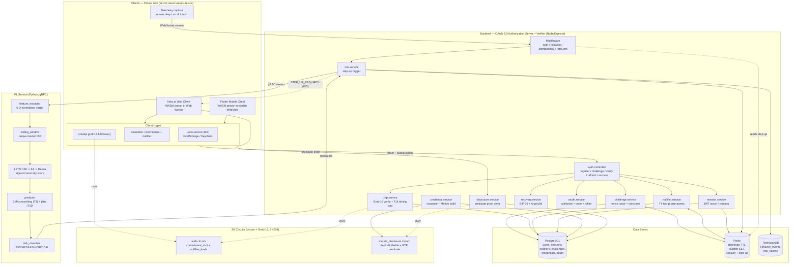
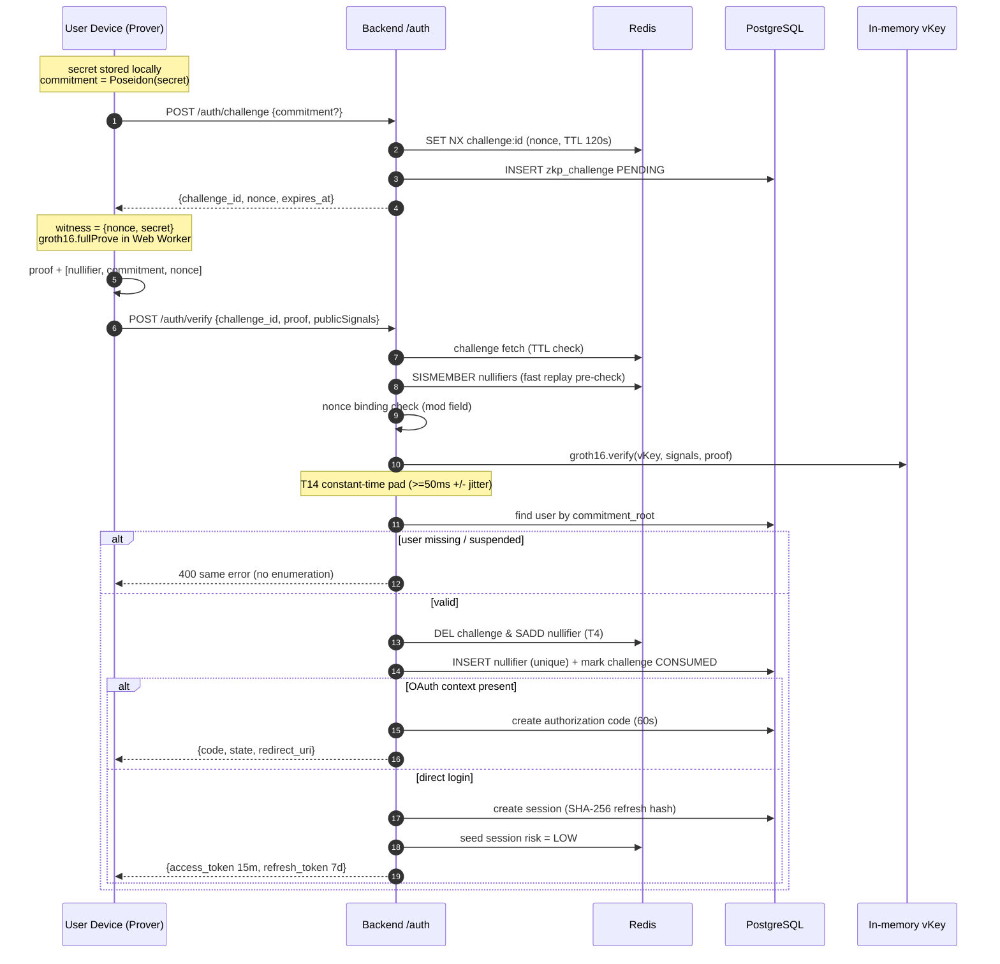
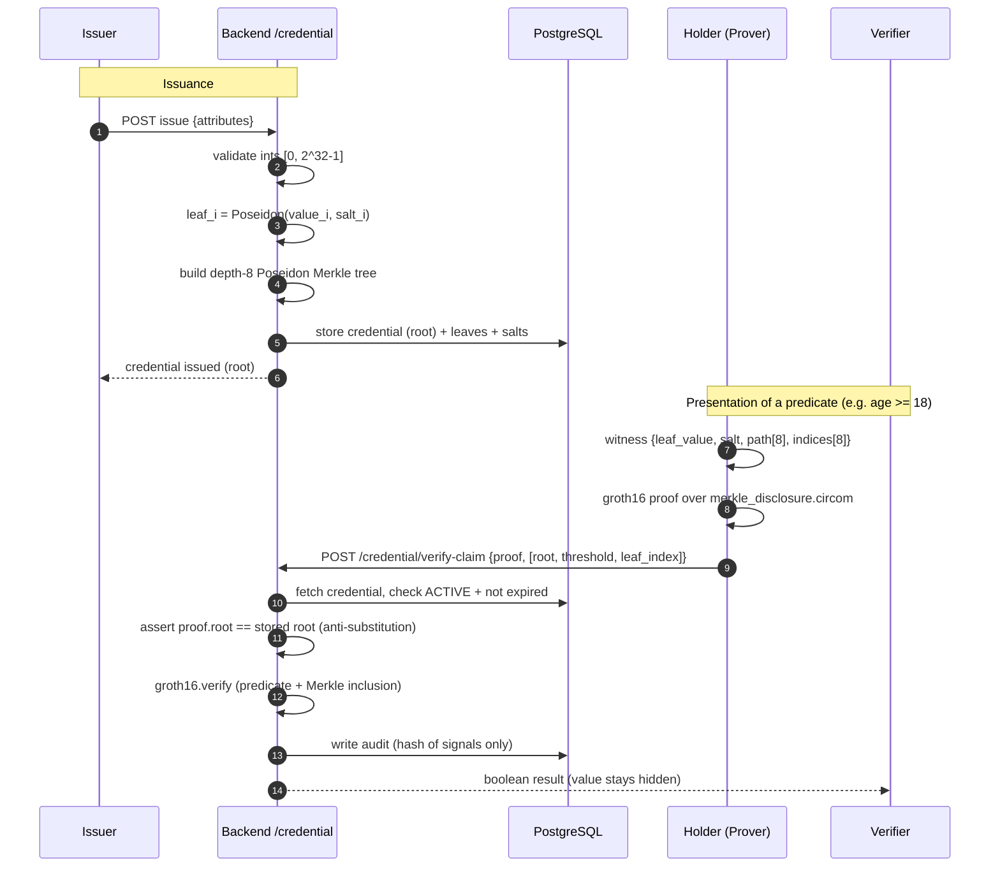
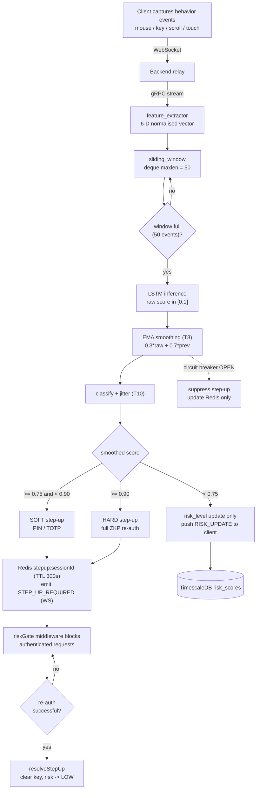

# ZK-Auth — Mermaid Diagrams

Paste any single diagram below (the code inside a ```mermaid block) into https://mermaid.live
Each diagram is self-contained.

---

## 1. Master Architecture + Data Flow (block diagram)



---

## 2. ZK Login Flow (sequence diagram)



---

## 3. Selective Disclosure Flow (sequence diagram)



---

## 4. Behavioral Risk + Step-Up Flow (flowchart)



---

## 5. Registration + Recovery Flow (flowchart)

```mermaid
flowchart TD
    subgraph REG["Registration (one-time)"]
        A1["Client: generate 32B secret"] --> A2["commitment = Poseidon(secret)"]
        A2 -->|"send commitment + pubkey only"| A3["POST /auth/register"]
        A3 --> A4{"commitment<br/>already exists?"}
        A4 -- yes --> A5["constant-time 300ms delay<br/>409 generic error"]
        A4 -- no --> A6["create user (tx)"]
        A6 --> A7["BIP-39 mnemonic<br/>Argon2id hash stored"]
        A7 --> A8["return mnemonic ONCE"]
    end

    subgraph REC["Recovery (lost key)"]
        B1["POST /auth/recover<br/>{mnemonic, new commitment}"] --> B2["Argon2id verify mnemonic"]
        B2 --> B3["burn recovery code<br/>revoke all sessions"]
        B3 --> B4["replace commitment<br/>status = PENDING_VERIFY"]
        B4 --> B5["issue 15-min recovery JWT"]
        B5 --> B6["new device: ZKP verify<br/>with X-Recovery-Token"]
        B6 --> B7["status -> ACTIVE"]
    end
```


